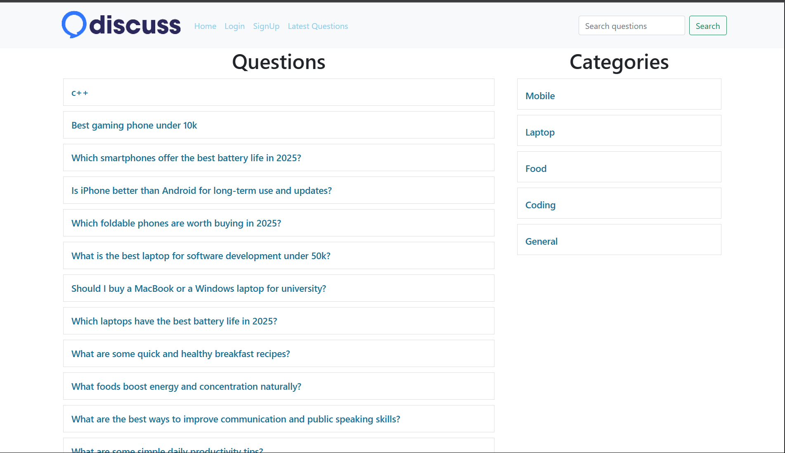
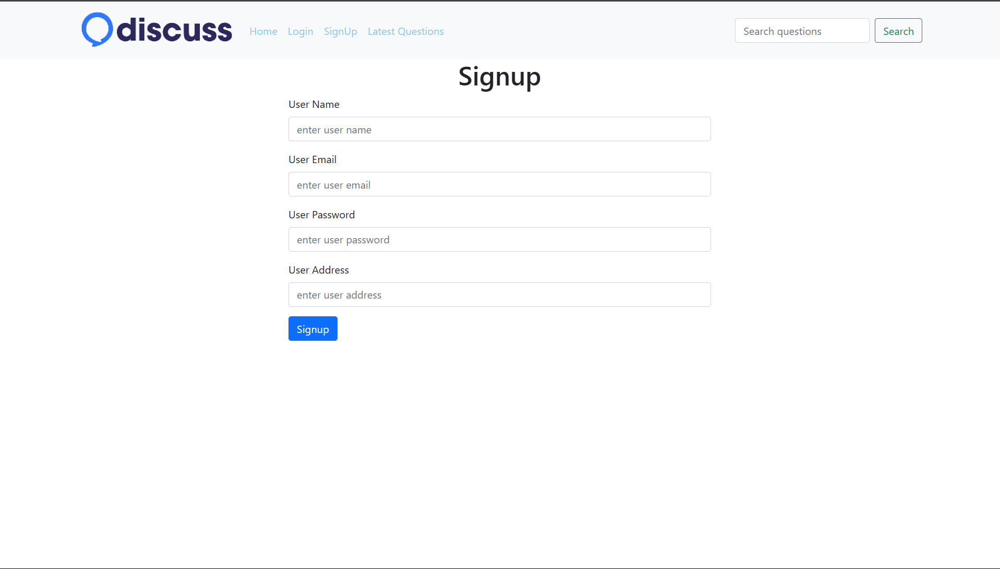
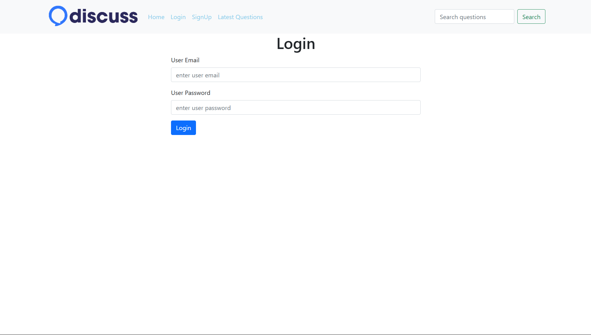

# 💬 Discuss – Q&A Web Application

A simple and interactive web-based Question & Answer platform where users can ask questions, answer them, and explore content based on category, user, and recent activity.

---

## 🚀 Features

- 🧑‍💻 **User Authentication**: Sign up, login, logout functionality.
- ❓ **Ask Questions**: Logged-in users can post questions with a title, description, and category.
- 💡 **Answer Questions**: Users can submit answers to any posted question.
- 🗂️ **Category-wise Questions**: Browse questions by category.
- 🔍 **Search Functionality**: Search questions by title.
- 👤 **My Questions**: Logged-in users can view their own questions.
- 🕑 **Latest Questions**: View all the most recent questions.
- 🧼 **Clean UI**: Bootstrap-based responsive layout.
- 🛠️ **Session Management** and basic route control in PHP.

---

## 🛠️ Tech Stack

- **Frontend**: HTML, CSS, Bootstrap
- **Backend**: PHP
- **Database**: MySQL
- **Other**: Apache (via XAMPP)

---

## 📁 Folder Structure

php_project/
├── client/
│ ├── ask.php
│ ├── header.php
│ ├── login.php
│ ├── question-details.php
│ ├── questions.php
│ ├── signup.php
├── public/
│ └── logo.png
├── server/
│ └── requests.php
├── common/
│ └── db.php
├── index.php
└── README.md


---

## 📷 Screenshots

> Include relevant screenshots of:
> - Homepage with questions
 
 > - SingUP
 
> - Login
   

---

## 🧑‍🎓 Setup Instructions (Local)

1. **Clone the Repository**
   ```bash
   git https://github.com/Nehalshaikh8698/Discussion-Board.git
   cd php_project

##Setup XAMPP

Start Apache and MySQL from XAMPP control panel.

Open phpmyadmin and create a database named: discuss

Import your .sql file (if available).

##Configure Database

Check common/db.php for DB credentials.

php
Copy code
$conn = new mysqli("localhost", "root", "", "discuss");

🗃️ Database Schema
users: id, username, email, password, address

questions: id, title, description, category_id, user_id

answers: id, answer, question_id, user_id

category: id, name

Ensure all tables are created with proper foreign key relationships and AUTO_INCREMENT on id.

🙋‍♂️ Author
Name: Nehal Shaikh

Tech Stack: PHP, MySQL, JS, Bootstrap, React, Python, AI & DS

College: D Y Patil College of Engineering, Akurdi, Pune


## 👐 Contributing

This project is open source and welcomes contributions!  
Feel free to fork the repository, make improvements, and open pull requests.

## 📄 License

This project is licensed under the [MIT License](./LICENSE).  
You may reuse, modify, and build on top of it **with credit**.